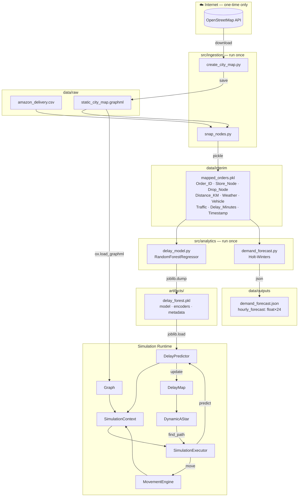
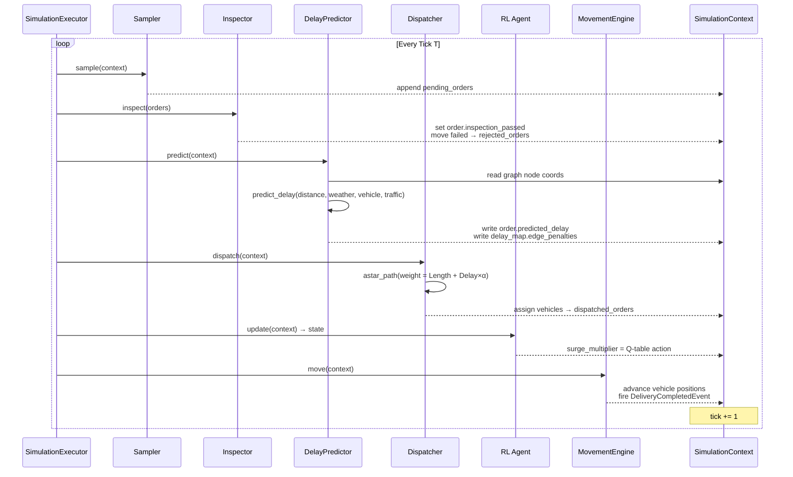
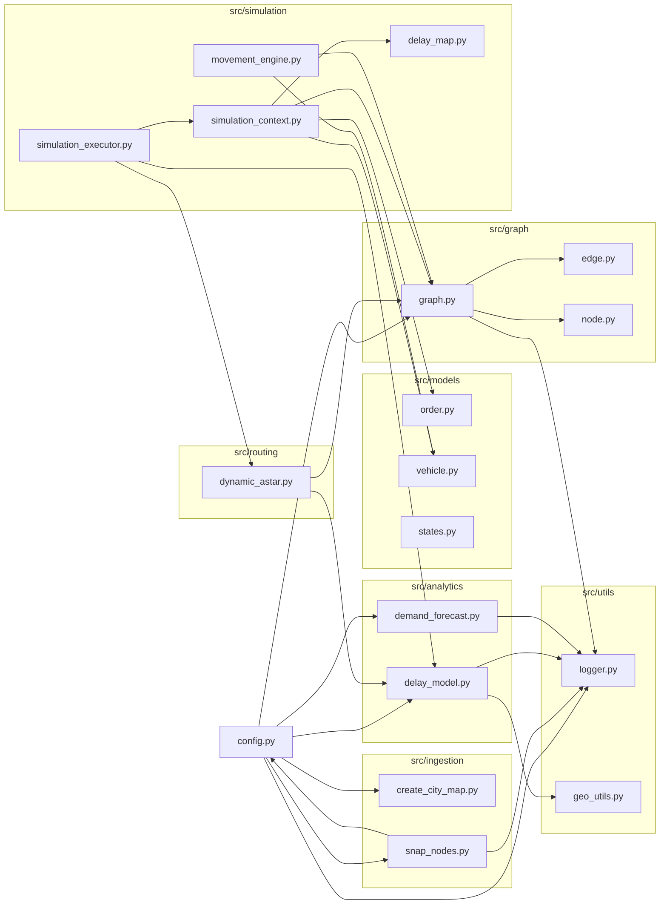
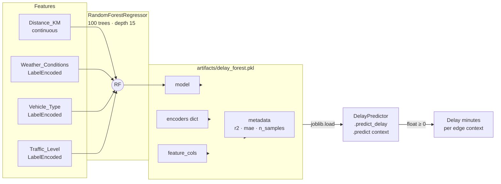
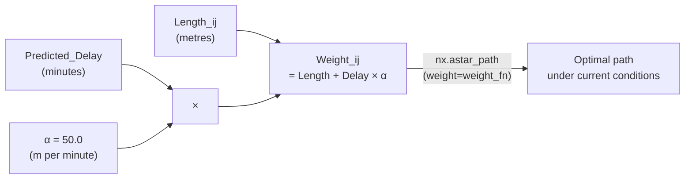
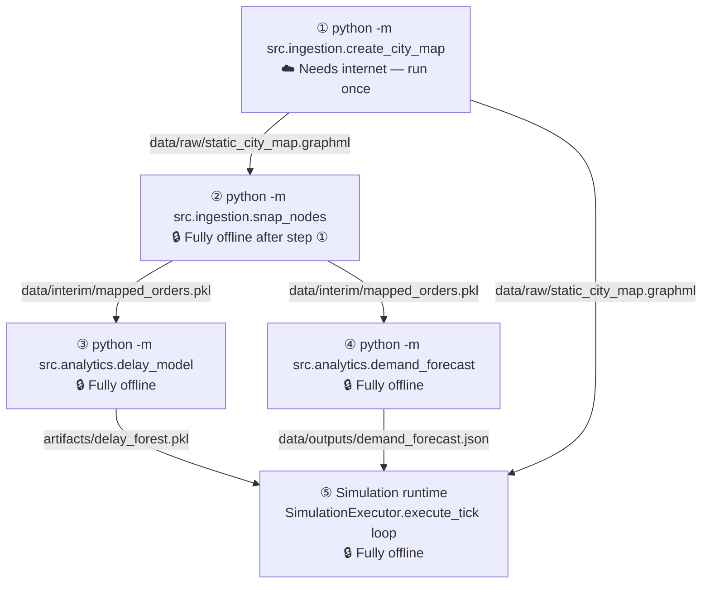

# LogiSim-AI — Architecture & Design Reference

## 1. Repository Layout

```
AAI-501-Introduction-to-AI-and-ML/
│
├── data/                          # All file-based data (gitignore large files)
│   ├── raw/
│   │   ├── amazon_delivery.csv    # Source delivery dataset (~43 k orders, India)
│   │   └── static_city_map.graphml# OSM road network — generated once, reused offline
│   ├── interim/
│   │   └── mapped_orders.pkl      # GPS coords snapped to OSM node IDs
│   └── outputs/
│       ├── demand_forecast.json   # 24-element hourly volume forecast
│       └── *.png                  # Optional diagnostic plots
│
├── artifacts/                     # Trained ML model bundles (binary, gitignored)
│   └── delay_forest.pkl           # RandomForest + encoders + metadata
│
├── logs/                          # Runtime log files (auto-created)
│   └── simulation.log
│
└── src/                           # All source code
    ├── config.py                  # Single source of truth for all paths & constants
    │
    ├── ingestion/                 # Data preparation (run before simulation)
    │   ├── create_city_map.py     # Downloads OSM road network → data/raw/
    │   └── snap_nodes.py          # Snaps GPS coords to node IDs → data/interim/
    │
    ├── graph/                     # Road-network primitives
    │   ├── graph.py               # Graph class — loads .graphml, nearest-node, shortest-path
    │   ├── edge.py                # Edge dataclass (source, dest, length, travel_time, speed)
    │   └── node.py                # Node dataclass (id, latitude, longitude)
    │
    ├── models/                    # Business-domain entity dataclasses
    │   ├── order.py               # Order (pickup/delivery nodes, deadline, predicted_delay)
    │   ├── vehicle.py             # Vehicle (capacity, speed, route, load)
    │   └── states.py              # VehicleState & SimulationState enums
    │
    ├── analytics/                 # ML training & inference modules
    │   ├── delay_model.py         # Train RF regressor; DelayPredictor inference class
    │   └── demand_forecast.py     # Holt-Winters 24-h demand forecast
    │
    ├── routing/
    │   └── dynamic_astar.py       # DynamicAStar — A* with ML delay penalties on edges
    │
    ├── simulation/                # Tick-based simulation engine
    │   ├── simulation_executor.py # Orchestrates all 7 steps per tick
    │   ├── simulation_context.py  # Shared mutable state for one simulation run
    │   ├── movement_engine.py     # Moves vehicles along routes one edge per tick
    │   ├── delay_map.py           # Holds edge → penalty dict; updated each tick
    │   ├── events.py              # Event dataclasses (VehicleMoved, Delivered, …)
    │   ├── route.py               # Route dataclass (node list, distances, arrival times)
    │   ├── statistics.py          # Aggregate metrics (deliveries, distance, delay)
    │   ├── vehicle_position.py    # Tracks current node & route progress per vehicle
    │   ├── movement_result.py     # Result of a single vehicle movement step
    │   └── simulation_clock.py    # Simulation time management
    │
    └── utils/
        ├── geo_utils.py           # Haversine distance, travel-time estimation
        └── logger.py              # Unified file + console logger
```

---

## 2. Data Flow



---

## 3. Per-Tick Simulation Loop



---

## 4. Module Dependency Graph



---

## 5. ML Model — Delay Regressor



---

## 6. Dynamic A* Edge Weight



> **Tuning α**: The dispatcher can pass a custom `alpha` to `DynamicAStar(graph, predictor, alpha=...)`.  
> `α = 0` → pure physical distance routing.  
> `α = 100` → delay avoidance dominates.

---


---

## 8. Run Order



---

## 9. Shared Data Contract (cross-engineer schema)

| Field | Type | Set by | Consumed by |
|---|---|---|---|
| `Store_Node` | `int` (OSM node ID) | `snap_nodes.py` | Dispatcher, DynamicAStar |
| `Drop_Node` | `int` (OSM node ID) | `snap_nodes.py` | Dispatcher, DynamicAStar |
| `order.predicted_delay` | `float` (minutes) | `DelayPredictor.predict()` | Dispatcher, Statistics |
| `delay_map.edge_penalties` | `dict[(int,int), float]` | `DelayPredictor.predict()` | DynamicAStar weight function |
| `demand_forecast.json` | `{"hourly_forecast": float[24]}` | `demand_forecast.py` | RL pricing environment state matrix |
| `order.inspection_passed` | `bool \| None` | CNN Inspector (`pricing_env.py`) | Dispatcher (filters rejections) |
| `context.surge_multiplier` | `float` | Q-table RL agent | Pricing layer |
| `static_city_map.graphml` | GraphML file | `create_city_map.py` | `Graph.load()`, `snap_nodes.py` |
